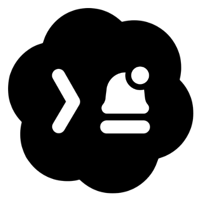

<p align="center">
  
</p>

<h1 align="center">Codex Notifier</h1>

<p align="center">
  Reliable completion and error notifications for Codex workflows in VS Code.
</p>

<p align="center">
  <a href="https://marketplace.visualstudio.com/items?itemName=zis3c.codex-notifier">
    
  </a>
  <a href="https://marketplace.visualstudio.com/items?itemName=zis3c.codex-notifier">
    
  </a>
  
  
</p>

A lightweight VS Code extension that notifies you when Codex responses finish using sound and configurable UI alerts (quiet status or banner popup).

> [!NOTE]
> Built for fast feedback loops: you can use auto-detection from Codex logs/chat, or manual file-trigger flow via `.codex-notify`.

## Features

- Completion and error notification commands.
- Bundled sound defaults (no custom setup required):
  - Complete -> `notification2.wav`
  - Error -> `notification1.wav`
- Auto completion detection from Codex stream logs.
- Optional document-based idle detection fallback.
- Quiet mode or banner mode for completion notifications.
- Manual trigger support through `.codex-notify` and `codex-done.ps1`.

## Commands

| Command | Description |
|:--|:--|
| `Codex Notifier: Notify Complete` | Trigger completion notification manually |
| `Codex Notifier: Notify Error` | Trigger error notification manually |
| `Codex Notifier: Test Sound` | Test completion sound + UI behavior |
| `Codex Notifier: Toggle Auto Notify` | Enable/disable log-based auto detection |
| `Codex Notifier: Show Diagnostics` | Show runtime diagnostics snapshot |
| `Codex Notifier: Debug Snapshot` | Print active docs/editors to output channel |

## Installation

### Option 1 (Recommended): VS Code Marketplace

1. Open Extensions view in VS Code (`Ctrl+Shift+X`).
2. Search `Codex Notifier`.
3. Click **Install** on `zis3c.codex-notifier`.

Direct link:
- https://marketplace.visualstudio.com/items?itemName=zis3c.codex-notifier

### Option 2: Command Line

```bash
code --install-extension zis3c.codex-notifier
```

### Option 3: VSIX (Offline/Manual)

See [INSTALLATION.md](./INSTALLATION.md) for VSIX steps.

## Quick Start

1. Open VS Code settings and search `Codex Notifier`.
2. Keep defaults (recommended): sound on, auto-detection on.
3. Run `Codex Notifier: Test Sound` from Command Palette.
4. Ask Codex something and wait for response completion notification.

## How It Works

1. On activation, the extension starts auto-detection watchers (Codex log/chat) and the manual file watcher.
2. For manual mode, it resolves `codexNotifier.watchFilePath` (default: `.codex-notify`) from your workspace root.
3. If no workspace folder is open, it falls back to the current process directory.
4. If the file does not exist, nothing is created automatically (manual trigger stays off until file exists).
5. When the file content changes:
   - Contains `error` -> error notification
   - Any other non-empty content -> complete notification
6. Auto mode can notify completion directly from Codex stream activity, so manual file writes are optional.

## Recommended Settings

```json
{
  "codexNotifier.enableSound": true,
  "codexNotifier.enablePopup": true,
  "codexNotifier.completionUseBanner": false,
  "codexNotifier.monitorCodexLog": true,
  "codexNotifier.codexLogPollMs": 500,
  "codexNotifier.codexLogIdleMs": 900,
  "codexNotifier.codexChatCooldownMs": 4500
}
```

## Documentation

- [INSTALLATION.md](./INSTALLATION.md)
- [CONTRIBUTING.md](./CONTRIBUTING.md)
- [SECURITY.md](./SECURITY.md)
- [AUTO_DEPLOY.md](./AUTO_DEPLOY.md)

## Project Structure

```text
codex-finish-notifier-vscode/
|- .gitignore                    # Git exclusions for local/dev artifacts
|- .vscodeignore                 # VSIX packaging exclusions
|- AUTO_DEPLOY.md                # Release/deploy workflow documentation
|- CONTRIBUTING.md               # Contribution workflow and coding notes
|- INSTALLATION.md               # End-user and dev installation guide
|- LICENSE                       # MIT license
|- README.md                     # Main documentation and feature overview
|- package.json                  # VS Code extension manifest/config schema
|- extension.js                  # Core extension runtime (commands + watchers)
|- codex-done.ps1                # Helper trigger script for .codex-notify flow
|- notification1.wav             # Bundled default sound (error)
|- notification2.wav             # Bundled default sound (complete)
|- codex-notifier-private.vsix   # Prebuilt install artifact for direct install
`- .vscode/
   `- launch.json                # Extension Development Host debug profile
```

Notes:
- `.vscode/settings.json` is intentionally local-only and not tracked in git.
- `.codex-notify` is runtime trigger data and not tracked in git.

## License

MIT. See [LICENSE](./LICENSE).

